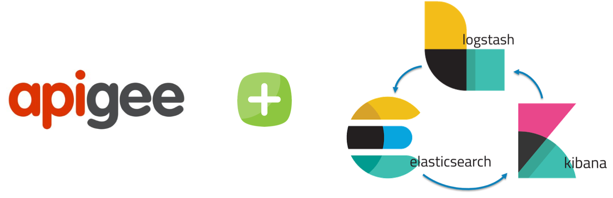

# Apigee Edge - External Message Logging to ELK stack



## About
This API proxy demonstrates message logging to ELK (Elastic, Logstash, Kibana) stack.

Those eager to see this in action -  Jump directly to  [How to use It](#how-to-use-it)

Apigee supports message logging to external systems like Loggly etc; Though sending logs to Loggly is much-much simpler, it took me quite some time and efforts to send logs, specially JSON to ELK stack, the policy configuration of this apiproxy at Apigee Edge side is much easy, however parsing the logs in JSON format was the difficult task.  

The objective of creating this repository to help Apigee developers to QuickStart with logging with ELK stack.   

## Out of scope
- Installation and configuration ELK stack. 
    - Having said that, you are free to setup and install ELK stack to check and validate this setup locally.
    - For demo purpose I followed this [link](https://logz.io/blog/elk-mac/) - installed on my local Mac.
    - If you install and test ELK on your local, you will have to make Logstash IP publicly available so Apigee edge can connect and send the message; You can use [`ngrok`](https://ngrok.com/) to publish locally installed Logstash to public IP/port, which is a great tool!
    - Install `ngrok` and tunnel your localhost to make it public accessible URL; I use below command to tunnel localhost, where `5044` is my local Logstash port.
    ```bash
    ./ngrok tcp 5044 --region eu
    ```
    - while running above command `ngrok` will display a public HOST, similar to below;

    ```
    ...
    Forwarding                    tcp://0.tcp.eu.ngrok.io:17063 -> localhost:5044
    ...
    ```
    - As an example;
        - Use 0.tcp.eu.ngrok.io as `Host` in [setMessageLogging.xml](apiproxy/policies/setMessageLogging.xml)
        - Use 17063 as `Port` in [setMessageLogging.xml](apiproxy/policies/setMessageLogging.xml)
    - DO NOT FORGET to add [Logstash configuration file](logstash-sample.conf) to Logstash to ensure correct parsing of the JSON coming from Apigee edge. 

## Prerequisite
- Apigee edge account
- Logstash IP and Port.
-- Make sure, there's connectivity between Apigee Edge and Logstash IP/Port. 
- Most important one, use Logstash configuration attached to this repo for parsing the log properly of you wish to have JSON parsed properly. 

## Recommended
- postman (to run postman collection)
- NodeJS (for newman and apigeetool)
- newman (node JS module to execute tests on local machine)
- apigeetool (deploying this proxy to Apigee edge)

## How to use it

### 1. Deploy API proxy to Apigee Edge
You can use either of the option mentioned below;
##### option 1: using `apigeetool`
You can deploy this API proxy by calling this command.

```bash
apigeetool deployproxy  -u {apigee_edge_account_email} -o {apigee_edge_org_name}  -e {environment_name} -n {proxy_name} -d . --verbose --debug
```
example; 
```bash
apigeetool deployproxy  -u kuldeep.bhati@devoteam.com -o abccorp-nonprod  -e test -n hello-world-elk-logging -d . --verbose --debug
```
For more information about `apigeetool` read here - https://www.npmjs.com/package/apigeetool

##### option 2: uploading a zip to apigee edge

1. Create a bundle zip file with below command;
```bash 
zip -r apiproxy.zip apiproxy
```

2. Upload it to apigee edge using proxy creation wizard.
Make sure it is deployed before testing.

### 2. Change IP/PORT of Logstash 
Once the API proxy is deployed, go to the message logging policy (setMessageLogging.xml) and add Logstash IP and Port as described in below code - https://gist.github.com/bhatikuldeep/d9fef45aefd9141dbfb3dba2bfc1c86d


## Unit Test (Optional)
Set the `proxy_endpoint` in [tests/test.postman_environment.json](tests/test.postman_environment.json) file before executing the command below.

You can test this API proxy by calling this command.
```bash
newman run "tests/apiproxy.postman_collection.json" -e "tests/test.postman_environment.json"
```

## Issues, questions and feedback
https://github.com/bhatikuldeep/hello-world-elk-logging/issues

## Some Tips
- IMHO, attached message logging policy - [setMessageLogging.xml](apiproxy/policies/setMessageLogging.xml) captures almost all necessary variables, please add/remove wherver necessary. Just make sure that JSON that you out is with whitespace removed to properly parse JSON at logstash side. I use http://jsonviewer.stack.hu/ to format JSON, validate JSON and remove white space. 
- Use index with name `apigee-*` when creating index using Kibana dashboard.

